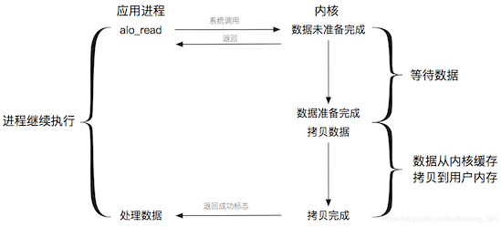

# IO概念-同步、异步、阻塞、非阻塞

::: tip 此文为转载 （通常一篇文章会参考多处，也会添加自己的理解，引用地址如有遗漏，请指出）

- https://blog.csdn.net/historyasamirror/article/details/5778378
- Others ... 

:::

按照通常的理解，这篇理论性的文章应该在最开始普及。但个人觉得，直接去看会比较晦涩，在我们大概了解了BIO和NIO之后，再回过头看这些理论，会更加清晰。这也为后面介绍AIO起到承上启下的作用。

 

## 引

同步（synchronous） IO和异步（asynchronous） IO，阻塞（blocking） IO和非阻塞（non-blocking）IO分别是什么，到底有什么区别？这个问题其实不同的人给出的答案都可能不同，比如wiki，就认为asynchronous IO和non-blocking IO是一个东西。这其实是因为不同的人的知识背景不同，并且在讨论这个问题的时候上下文(context)也不相同。所以，为了更好的回答这个问题，我先限定一下本文的上下文。

本文讨论的背景是Linux环境下的network IO。本文最重要的参考文献是Richard Stevens的“**UNIX® Network Programming Volume 1, Third Edition: The Sockets Networking** ”，6.2节“**I/O Models** ”，Stevens在这节中详细说明了各种IO的特点和区别

Stevens在文章中一共比较了五种IO Model：

- blocking IO
- nonblocking IO
- IO multiplexing
- signal driven IO
- asynchronous IO

由于signal driven IO在实际中并不常用，所以我这只提及剩下的四种IO Model。

对于一个network IO (这里我们以read举例)，它会涉及到两个系统对象，一个是调用这个IO的process (or thread)，另一个就是系统内核(kernel)。当一个read操作发生时，它会经历两个阶段：

1. 等待数据准备 (Waiting for the data to be ready) - 准备数据，将数据从存储介质(例如硬盘、Socket等)加载到内核缓存。
2. 将数据从内核拷贝到进程中 (Copying the data from the kernel to the process) - 拷贝数据，将数据从内核缓存拷贝到用户内存。

记住这两点很重要，因为这些IO Model的区别就是在两个阶段上各有不同的情况。

## **阻塞IO**

在Linux中，默认情况下所有的Socket都是阻塞IO。一个典型的阻塞读IO操作如下图所示:

 

当应用进程调用了recvfrom这个系统调用，操作系统内核就开始了IO的第一个阶段 : 准备数据。 对于网络IO来说，很多情况下数据并不能一次性到达 (比如，还没有收到一个完整的UDP包 )，此时操作系统内核需要等待完整的数据到来。 此时，应用进程整个进程会被阻塞。 当操作系统内核数据准备好了，它会将数据从内核缓存中拷贝到应用内存，应用进程才解除阻塞的状态，重新运行。 **所以，阻塞IO的特点就是在IO操作的两个阶段准备数据和拷贝数据都被阻塞了**。

## **非阻塞IO**

Linux下，可以通过设置Socket使其变为非阻塞IO。一个典型的非阻塞读IO操作如下图所示:

 

当应用进程recvfrom这个系统调用，如果操作系统内核中的数据还没有准备好，那么它并不会阻塞应用进程，而是立刻返回一个error。从应用进程角度讲 ，它发起一个read操作后，并不需要阻塞，而是马上就得到了一个结果。当用户进程判断结果为error时，它能够判断数据还没有准备好，于是它可以再次发送read操作。 一旦操作系统内核中的数据准备完成，并且又再次收到了用户进程的read操作，那么它立刻将数据拷贝到了用户内存，然后成功标识。 **所以，在非阻塞式IO中，用户进程需要不断的轮询操作系统内核数据是否准备好**。

## **阻塞IO与非阻塞IO区别**

- **阻塞IO : 应用进程在准备数据和拷贝数据两个阶段等待数据。**
- **非阻塞IO : 应用进程在准备数据阶段轮询，在拷贝数据阶段等待数据。** 

**注 : 阻塞IO和非阻塞IO均为同步IO。**

## **IO复用 (IO multiplexing)** 

IO multiplexing这个词可能有点陌生，但是如果我说select，epoll，大概就都能明白了。有些地方也称这种IO方式为event driven IO。我们都知道，select/epoll的好处就在于单个process就可以同时处理多个网络连接的IO。它的基本原理就是select/epoll这个function会不断的轮询所负责的所有socket，当某个socket有数据到达了，就通知用户进程。（多路复用IO模型是目前使用得比较多的模型。Java NIO实际上就是多路复用IO）。它的流程如图：

 

用户进程调用了select，那么整个进程会被block，而同时，kernel会“监视”所有select负责的socket，当任何一个socket中的数据准备好了，select就会返回。这个时候用户进程再调用read操作，将数据从kernel拷贝到用户进程。

这个图和blocking IO的图其实并没有太大的不同，事实上，还更差一些。因为这里需要使用两个system call (select 和 recvfrom)，而blocking IO只调用了一个system call (recvfrom)。但是，用select的优势在于它可以同时处理多个connection。（**多说一句。所以，如果处理的连接数不是很高的话，使用select/epoll的web server不一定比使用multi-threading + blocking IO的web server性能更好，可能延迟还更大。select/epoll的优势并不是对于单个连接能处理得更快，而是在于能处理更多的连接。**）

在IO multiplexing Model中，实际中，对于每一个socket，一般都设置成为non-blocking，但是，如上图所示，整个用户的process其实是一直被block的。只不过process是被select这个函数block，而不是被socket IO给block。

#### 文件描述符fd

Linux的内核将所有外部设备都可以看做一个文件来操作。那么我们对与外部设备的操作都可以看做对文件进行操作。我们对一个文件的读写，都通过调用内核提供的系统调用；内核给我们返回一个filede scriptor（fd,文件描述符）。而对一个socket的读写也会有相应的描述符，称为socketfd(socket描述符）。描述符就是一个数字，指向内核中一个结构体（文件路径，数据区，等一些属性）。那么我们的应用程序对文件的读写就通过对描述符的读写完成。

#### select

**基本原理**：select 函数监视的文件描述符分3类，分别是writefds、readfds、和exceptfds。调用后select函数会阻塞，直到有描述符就绪（有数据 可读、可写、或者有except），或者超时（timeout指定等待时间，如果立即返回设为null即可），函数返回。当select函数返回后，可以通过遍历fdset，来找到就绪的描述符。

**缺点**: 1、select最大的缺陷就是单个进程所打开的FD是有一定限制的，它由FD_SETSIZE设置，32位机默认是1024个，64位机默认是2048。 一般来说这个数目和系统内存关系很大，”具体数目可以cat /proc/sys/fs/file-max察看”。32位机默认是1024个。64位机默认是2048. 2、对socket进行扫描时是线性扫描，即采用轮询的方法，效率较低。 当套接字比较多的时候，每次select()都要通过遍历FD_SETSIZE个Socket来完成调度，不管哪个Socket是活跃的，都遍历一遍。这会浪费很多CPU时间。”如果能给套接字注册某个回调函数，当他们活跃时，自动完成相关操作，那就避免了轮询”，这正是epoll与kqueue做的。 3、需要维护一个用来存放大量fd的数据结构，这样会使得用户空间和内核空间在传递该结构时复制开销大。

#### poll

**基本原理**：poll本质上和select没有区别，它将用户传入的数组拷贝到内核空间，然后查询每个fd对应的设备状态，如果设备就绪则在设备等待队列中加入一项并继续遍历，如果遍历完所有fd后没有发现就绪设备，则挂起当前进程，直到设备就绪或者主动超时，被唤醒后它又要再次遍历fd。这个过程经历了多次无谓的遍历。

**它没有最大连接数的限制，原因是它是基于链表来存储的，但是同样有一个缺点：** 1、大量的fd的数组被整体复制于用户态和内核地址空间之间，而不管这样的复制是不是有意义。 2 、poll还有一个特点是“水平触发”，如果报告了fd后，没有被处理，那么下次poll时会再次报告该fd。

**注意**：从上面看，select和poll都需要在返回后，通过遍历文件描述符来获取已经就绪的socket。事实上，同时连接的大量客户端在一时刻可能只有很少的处于就绪状态，因此随着监视的描述符数量的增长，其效率也会线性下降。

#### epoll

epoll是在2.6内核中提出的，是之前的select和poll的增强版本。相对于select和poll来说，epoll更加灵活，没有描述符限制。epoll使用一个文件描述符管理多个描述符，将用户关系的文件描述符的事件存放到内核的一个事件表中，这样在用户空间和内核空间的copy只需一次。

**基本原理**：epoll支持水平触发和边缘触发，最大的特点在于边缘触发，它只告诉进程哪些fd刚刚变为就绪态，并且只会通知一次。还有一个特点是，epoll使用“事件”的就绪通知方式，通过epoll_ctl注册fd，一旦该fd就绪，内核就会采用类似callback的回调机制来激活该fd，epoll_wait便可以收到通知。

**epoll的优点**： 1、没有最大并发连接的限制，能打开的FD的上限远大于1024（1G的内存上能监听约10万个端口）。 2、效率提升，不是轮询的方式，不会随着FD数目的增加效率下降。 只有活跃可用的FD才会调用callback函数；即Epoll最大的优点就在于它只管你“活跃”的连接，而跟连接总数无关，因此在实际的网络环境中，Epoll的效率就会远远高于select和poll。 3、内存拷贝，利用mmap()文件映射内存加速与内核空间的消息传递；即epoll使用mmap减少复制开销。

**JDK1.5_update10版本使用epoll替代了传统的select/poll，极大的提升了NIO通信的性能。**

> **备注：**JDK NIO的BUG，例如臭名昭著的epoll bug，它会导致Selector空轮询，最终导致CPU 100%。官方声称在JDK1.6版本的update18修复了该问题，但是直到JDK1.7版本该问题仍旧存在，只不过该BUG发生概率降低了一些而已，它并没有被根本解决。**这个可以在后续netty系列里面进行说明下。**

## **异步IO**

一个典型的异步读IO操作如下图所示:

 

用户进程发起read操作之后，立刻就可以开始去做其它的事。而另一方面，从kernel的角度，当它受到一个asynchronous read之后，首先它会立刻返回，所以不会对用户进程产生任何block。然后，kernel会等待数据准备完成，然后将数据拷贝到用户内存，当这一切都完成之后，kernel会给用户进程发送一个signal，告诉它read操作完成了。

## 总结

到目前为止，已经将四个IO Model都介绍完了。现在回过头来回答最初的那几个问题：blocking和non-blocking的区别在哪，synchronous IO和asynchronous IO的区别在哪。

先回答最简单的这个：blocking vs non-blocking。前面的介绍中其实已经很明确的说明了这两者的区别。调用blocking IO会一直block住对应的进程直到操作完成，而non-blocking IO在kernel还准备数据的情况下会立刻返回。

在说明synchronous IO和asynchronous IO的区别之前，需要先给出两者的定义。Stevens给出的定义（其实是POSIX的定义）是这样子的：

> A synchronous I/O operation causes the requesting process to be blocked until that I/O operation completes;
>
> An asynchronous I/O operation does not cause the requesting process to be blocked; 

两者的区别就在于synchronous IO做”IO operation”的时候会将process阻塞。按照这个定义，之前所述的**blocking IO，non-blocking IO，IO multiplexing**都属于**synchronous IO**。有人可能会说，non-blocking IO并没有被block啊。这里有个非常“狡猾”的地方，定义中所指的”IO operation”是指真实的IO操作，就是例子中的recvfrom这个system call。non-blocking IO在执行recvfrom这个system call的时候，如果kernel的数据没有准备好，这时候不会block进程。但是，当kernel中数据准备好的时候，recvfrom会将数据从kernel拷贝到用户内存中，这个时候进程是被block了，在这段时间内，进程是被block的。而asynchronous IO则不一样，当进程发起IO 操作之后，就直接返回再也不理睬了，直到kernel发送一个信号，告诉进程说IO完成。在这整个过程中，进程完全没有被block。

各个IO Model的比较如图所示：

 

经过上面的介绍，会发现non-blocking IO和asynchronous IO的区别还是很明显的。在non-blocking IO中，虽然进程大部分时间都不会被block，但是它仍然要求进程去主动的check，并且当数据准备完成以后，也需要进程主动的再次调用recvfrom来将数据拷贝到用户内存。而asynchronous IO则完全不同。它就像是用户进程将整个IO操作交给了他人（kernel）完成，然后他人做完后发信号通知。在此期间，用户进程不需要去检查IO操作的状态，也不需要主动的去拷贝数据。

#### **从同步、异步，以及阻塞、非阻塞两个维度来划分来看：**

> 最后，再举几个不是很恰当的例子来说明这四个IO Model:
>
> 有A，B，C，D四个人在钓鱼：
>
> A用的是最老式的鱼竿，所以呢，得一直守着，等到鱼上钩了再拉杆；
>
> B的鱼竿有个功能，能够显示是否有鱼上钩，所以呢，B就和旁边的MM聊天，隔会再看看有没有鱼上钩，有的话就迅速拉杆；
>
> C用的鱼竿和B差不多，但他想了一个好办法，就是同时放好几根鱼竿，然后守在旁边，一旦有显示说鱼上钩了，它就将对应的鱼竿拉起来；
>
> D是个有钱人，干脆雇了一个人帮他钓鱼，一旦那个人把鱼钓上来了，就给D发个短信。

## 延伸阅读

### 两种高性能IO设计模式 - Reactor and Proactor

在传统的网络服务设计模式中，有两种比较经典的模式：一种是多线程，一种是线程池。 对于**多线程模式**，也就说来了client，服务器就会新建一个线程来处理该client的读写事件。 这种模式虽然处理起来简单方便，但是由于服务器为每个client的连接都采用一个线程去处理，使得资源占用非常大。因此，当连接数量达到上限时，再有用户请求连接，直接会导致资源瓶颈，严重的可能会直接导致服务器崩溃。 因此，为了解决这种一个线程对应一个客户端模式带来的问题，提出了采用**线程池的方式**，也就说创建一个固定大小的线程池，来一个客户端，就从线程池取一个空闲线程来处理，当客户端处理完读写操作之后，就交出对线程的占用。因此这样就避免为每一个客户端都要创建线程带来的资源浪费，使得线程可以重用。 但是线程池也有它的弊端，如果连接大多是长连接，因此可能会导致在一段时间内，线程池中的线程都被占用，那么当再有用户请求连接时，由于没有可用的空闲线程来处理，就会导致客户端连接失败，从而影响用户体验。因此，线程池比较适合大量的短连接应用。

因此便出现了下面的两种高性能IO设计模式：**Reactor**和**Proactor**。

 

从这里可以看出，上面的五种IO模型中的**多路复用IO**就是采用**Reactor**模式。注意，上面的图中展示的 是顺序处理每个事件，当然为了提高事件处理速度，可以通过多线程或者线程池的方式来处理事件。

在**Proactor**模式中，当检测到有事件发生时，会新起一个异步操作，然后交由内核线程去处理，当内核线程完成IO操作之后，发送一个通知告知操作已完成，可以得知，异步IO模型采用的就是Proactor模式。