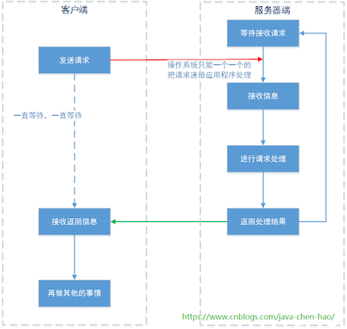
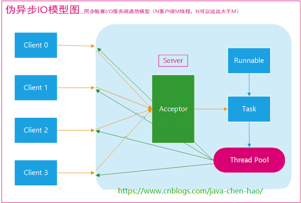
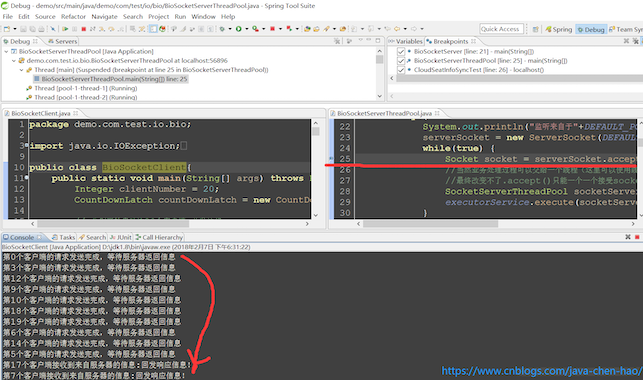

# JavaBIO 模型

::: tip 此文为转载 （通常一篇文章会参考多处，也会添加自己的理解，引用地址如有遗漏，请指出）

- https://www.cnblogs.com/java-chen-hao/p/11076176.html

:::

<br />

在上文 [Java网络编程](https://heyan.site:8001/Java/JavaNIO/Java%E7%BD%91%E7%BB%9C%E7%BC%96%E7%A8%8B.html) 里面，我们在文末已经讲解了Java BIO的基本用法，本篇将更加详细的分析BIO模型。


## **回顾-最原始BIO**

网络编程的基本模型是C/S模型，即两个进程间的通信。<br>服务端提供IP和监听端口，客户端通过连接操作想服务端监听的地址发起连接请求，通过三次握手连接，如果连接成功建立，双方就可以通过套接字进行通信。<br>传统的同步阻塞模型开发中，ServerSocket负责绑定IP地址，启动监听端口；Socket负责发起连接操作。连接成功后，双方通过输入和输出流进行同步阻塞式通信。

最原始BIO通信模型图：

<div style="display:flex;"></div>

存在的问题：

- 同一时间，服务器只能接受来自于客户端A的请求信息；虽然客户端A和客户端B的请求是同时进行的，但客户端B发送的请求信息只能等到服务器接受完A的请求数据后，才能被接受。(acceptor只有在接受完client1的请求后才能接受client2的请求)
- 由于服务器一次只能处理一个客户端请求，当处理完成并返回后（或者异常时），才能进行第二次请求的处理。很显然，这样的处理方式在高并发的情况下，是不能采用的。


## **一请求一线程BIO**

那有没有方法改进呢? ，答案是有的。改进后BIO通信模型图：

<div style="display:flex;"></div>

此种BIO通信模型的服务端，通常由一个独立的Acceptor线程负责监听客户端的连接，它接收到客户端连接请求之后为每个客户端创建一个新的线程进行链路处理,每处理完成后，通过输出流返回应答给客户端，线程销毁。即典型的一请求一应答通宵模型。**代码演示**:

服务端：

```java
package demo.com.test.io.bio;

import java.io.IOException;
import java.io.InputStream;
import java.io.OutputStream;
import java.net.ServerSocket;
import java.net.Socket;

import demo.com.test.io.nio.NioSocketServer;

public class BioSocketServer {
   //默认的端口号  
   private static int DEFAULT_PORT = 8083;  

   public static void main(String[] args) {
       ServerSocket serverSocket = null;
       try {
           System.out.println("监听来自于"+DEFAULT_PORT+"的端口信息");
           serverSocket = new ServerSocket(DEFAULT_PORT);
           while(true) {
               Socket socket = serverSocket.accept();
               SocketServerThread socketServerThread = new SocketServerThread(socket);
               new Thread(socketServerThread).start();
           }
       } catch(Exception e) {

       } finally {
           if(serverSocket != null) {
               try {
                   serverSocket.close();
               } catch (IOException e) {
                   // TODO Auto-generated catch block
                   e.printStackTrace();
               }
           }
       }

        //这个wait不涉及到具体的实验逻辑，只是为了保证守护线程在启动所有线程后，进入等待状态
       synchronized (NioSocketServer.class) {
           try {
               BioSocketServer.class.wait();
           } catch (InterruptedException e) {
               // TODO Auto-generated catch block
               e.printStackTrace();
           }
       }
   }
}  

class SocketServerThread implements Runnable {
   private Socket socket;
   public SocketServerThread (Socket socket) {
       this.socket = socket;
   }
   @Override
   public void run() {
       InputStream in = null;
       OutputStream out = null;
       try {
           //下面我们收取信息
           in = socket.getInputStream();
           out = socket.getOutputStream();
           Integer sourcePort = socket.getPort();
           int maxLen = 1024;
           byte[] contextBytes = new byte[maxLen];
           //使用线程，同样无法解决read方法的阻塞问题，
           //也就是说read方法处同样会被阻塞，直到操作系统有数据准备好
           int realLen = in.read(contextBytes, 0, maxLen);
           //读取信息
           String message = new String(contextBytes , 0 , realLen);

           //下面打印信息
           System.out.println("服务器收到来自于端口：" + sourcePort + "的信息：" + message);

           //下面开始发送信息
           out.write("回发响应信息！".getBytes());
       } catch(Exception e) {
           System.out.println(e.getMessage());
       } finally {
           //试图关闭
           try {
               if(in != null) {
                   in.close();
               }
               if(out != null) {
                   out.close();
               }
               if(this.socket != null) {
                   this.socket.close();
               }
           } catch (IOException e) {
               System.out.println(e.getMessage());
           }
       }
   }
}
```

客户端

```java
package demo.com.test.io.bio;

import java.io.IOException;
import java.io.InputStream;
import java.io.OutputStream;
import java.net.Socket;
import java.net.URLDecoder;
import java.util.concurrent.CountDownLatch;

public class BioSocketClient{
   public static void main(String[] args) throws Exception {
       Integer clientNumber = 20;
       CountDownLatch countDownLatch = new CountDownLatch(clientNumber);

       // 分别开始启动这20个客户端,并发访问
       for (int index = 0; index < clientNumber; index++, countDownLatch.countDown()) {
           ClientRequestThread client = new ClientRequestThread(countDownLatch, index);
           new Thread(client).start();
       }

       // 这个wait不涉及到具体的实验逻辑，只是为了保证守护线程在启动所有线程后，进入等待状态
       synchronized (BioSocketClient.class) {
           BioSocketClient.class.wait();
       }
   }
}


/**
* 一个ClientRequestThread线程模拟一个客户端请求。
* @author keep_trying
*/
class ClientRequestThread implements Runnable {

   private CountDownLatch countDownLatch;

   /**
    * 这个线程的编号
    * @param countDownLatch
    */
   private Integer clientIndex;

   /**
    * countDownLatch是java提供的同步计数器。
    * 当计数器数值减为0时，所有受其影响而等待的线程将会被激活。这样保证模拟并发请求的真实性
    * @param countDownLatch
    */
   public ClientRequestThread(CountDownLatch countDownLatch , Integer clientIndex) {
       this.countDownLatch = countDownLatch;
       this.clientIndex = clientIndex;
   }

   @Override
   public void run() {
       Socket socket = null;
       OutputStream clientRequest = null;
       InputStream clientResponse = null;

       try {
           socket = new Socket("localhost",8083);
           clientRequest = socket.getOutputStream();
           clientResponse = socket.getInputStream();

           //等待，直到SocketClientDaemon完成所有线程的启动，然后所有线程一起发送请求
           this.countDownLatch.await();

           //发送请求信息
           clientRequest.write(("这是第" + this.clientIndex + " 个客户端的请求。 over").getBytes());
           clientRequest.flush();

           //在这里等待，直到服务器返回信息
          System.out.println("第" + this.clientIndex + "个客户端的请求发送完成，等待服务器返回信息");
           int maxLen = 1024;
           byte[] contextBytes = new byte[maxLen];
           int realLen;
           String message = "";
           //程序执行到这里，会一直等待服务器返回信息（注意，前提是in和out都不能close，如果close了就收不到服务器的反馈了）
           while((realLen = clientResponse.read(contextBytes, 0, maxLen)) != -1) {
               message += new String(contextBytes , 0 , realLen);
           }
           //String messageEncode = new String(message , "UTF-8");
           message = URLDecoder.decode(message, "UTF-8");
           System.out.println("第" + this.clientIndex + "个客户端接收到来自服务器的信息:" + message);
       } catch (Exception e) {

       } finally {
           try {
               if(clientRequest != null) {
                   clientRequest.close();
               }
               if(clientResponse != null) {
                   clientResponse.close();
               }
           } catch (IOException e) {

           }
       }
   }
}   
```

**存在的问题**：

- 虽然在服务器端，请求的处理交给了一个独立线程进行，但是操作系统通知accept()的方式还是单个的。也就是，实际上是服务器接收到数据报文后的“业务处理过程”可以多线程，但是数据报文的接受还是需要一个一个的来(acceptor只有在接受完client1的请求后才能接受client2的请求)，下文会验证。
- 在linux系统中，可以创建的线程是有限的。我们可以通过cat /proc/sys/kernel/threads-max命令查看可以创建的最大线程数。当然这个值是可以更改的，但是线程越多，CPU切换所需的时间也就越长，用来处理真正业务的需求也就越少。
- 另外，如果您的应用程序大量使用长连接的话，线程是不会关闭的。这样系统资源的消耗更容易失控。


## **伪异步I/O编程**

为了改进这种一连接一线程的模型，我们可以使用线程池来管理这些线程，实现1个或多个线程处理N个客户端的模型（但是底层还是使用的同步阻塞I/O），通常被称为“伪异步I/O模型“。

伪异步I/O模型图：

<div style="display:flex;"></div>

**代码演示** - 只给出服务端(客户端和上面相同)

```java
package demo.com.test.io.bio;

import java.io.IOException;
import java.io.InputStream;
import java.io.OutputStream;
import java.net.ServerSocket;
import java.net.Socket;
import java.util.concurrent.ExecutorService;
import java.util.concurrent.Executors;

import demo.com.test.io.nio.NioSocketServer;

public class BioSocketServerThreadPool {
   //默认的端口号  
   private static int DEFAULT_PORT = 8083;  
   //线程池 懒汉式的单例  
   private static ExecutorService executorService = Executors.newFixedThreadPool(60);  

   public static void main(String[] args) {
       ServerSocket serverSocket = null;
       try {
           System.out.println("监听来自于"+DEFAULT_PORT+"的端口信息");
           serverSocket = new ServerSocket(DEFAULT_PORT);
           while(true) {
               Socket socket = serverSocket.accept();
               //当然业务处理过程可以交给一个线程（这里可以使用线程池）,并且线程的创建是很耗资源的。
               //最终改变不了.accept()只能一个一个接受socket的情况,并且被阻塞的情况
               SocketServerThreadPool socketServerThreadPool = new SocketServerThreadPool(socket);
               executorService.execute(socketServerThreadPool);
           }
       } catch(Exception e) {

       } finally {
           if(serverSocket != null) {
               try {
                   serverSocket.close();
               } catch (IOException e) {
                   // TODO Auto-generated catch block
                   e.printStackTrace();
               }
           }
       }

        //这个wait不涉及到具体的实验逻辑，只是为了保证守护线程在启动所有线程后，进入等待状态
       synchronized (NioSocketServer.class) {
           try {
               BioSocketServerThreadPool.class.wait();
           } catch (InterruptedException e) {
               // TODO Auto-generated catch block
               e.printStackTrace();
           }
       }
   }
}  

class SocketServerThreadPool implements Runnable {
   private Socket socket;
   public SocketServerThreadPool (Socket socket) {
       this.socket = socket;
   }
   @Override
   public void run() {
       InputStream in = null;
       OutputStream out = null;
       try {
           //下面我们收取信息
           in = socket.getInputStream();
           out = socket.getOutputStream();
           Integer sourcePort = socket.getPort();
           int maxLen = 1024;
           byte[] contextBytes = new byte[maxLen];
           //使用线程，同样无法解决read方法的阻塞问题，
           //也就是说read方法处同样会被阻塞，直到操作系统有数据准备好
           int realLen = in.read(contextBytes, 0, maxLen);
           //读取信息
           String message = new String(contextBytes , 0 , realLen);

           //下面打印信息
           System.out.println("服务器收到来自于端口：" + sourcePort + "的信息：" + message);

           //下面开始发送信息
           out.write("回发响应信息！".getBytes());
       } catch(Exception e) {
           System.out.println(e.getMessage());
       } finally {
           //试图关闭
           try {
               if(in != null) {
                   in.close();
               }
               if(out != null) {
                   out.close();
               }
               if(this.socket != null) {
                   this.socket.close();
               }
           } catch (IOException e) {
               System.out.println(e.getMessage());
           }
       }
   }
}
```

服务器端的执行效果

<div style="display:flex;"></div>

在 **`Socket socket = serverSocket.accept();`** 处打了断点，有20个客户端同时发出请求，可服务端还是一个一个的处理，其它线程都处于阻塞状态


## **阻塞的问题根源**

那么重点的问题并不是“是否使用了多线程、或是线程池”，而是为什么accept()、read()方法会被阻塞。API文档中对于 serverSocket.accept() 方法的使用描述：

> Listens for a connection to be made to this socket and accepts it. The method blocks until a connection is made.

服务器线程发起一个accept动作，询问操作系统 是否有新的socket套接字信息从端口xx发送过来。<br>注意，是询问操作系统。也就是说socket套接字的IO模式支持是基于操作系统的，那么自然同步IO/异步IO的支持就是需要操作系统级别的了。如下图：

<div style="display:flex;"></div>

如果操作系统没有发现有套接字从指定的端口xx来，那么操作系统就会等待。这样serverSocket.accept()方法就会一直等待。这就是为什么accept()方法为什么会阻塞：**它内部的实现是使用的操作系统级别的同步IO**。

- **阻塞IO 和 非阻塞IO**

这两个概念是程序级别的。主要描述的是程序请求操作系统IO操作后，如果IO资源没有准备好，那么程序该如何处理的问题：前者等待（不会交出CPU）；后者继续执行（并且使用线程一直轮询，直到有IO资源准备好了 - 好处是可以让出CPU资源）

- **同步IO 和 非同步IO**

这两个概念是操作系统级别的。主要描述的是操作系统在收到程序请求IO操作后，如果IO资源没有准备好，该如何处理相应程序的问题：前者不响应，直到IO资源准备好以后；后者返回一个标记（好让程序和自己知道以后的数据往哪里通知），当IO资源准备好以后，再用事件机制返回给程序。