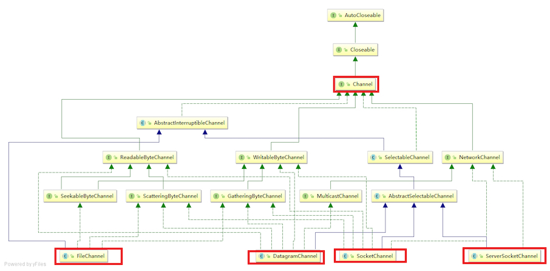
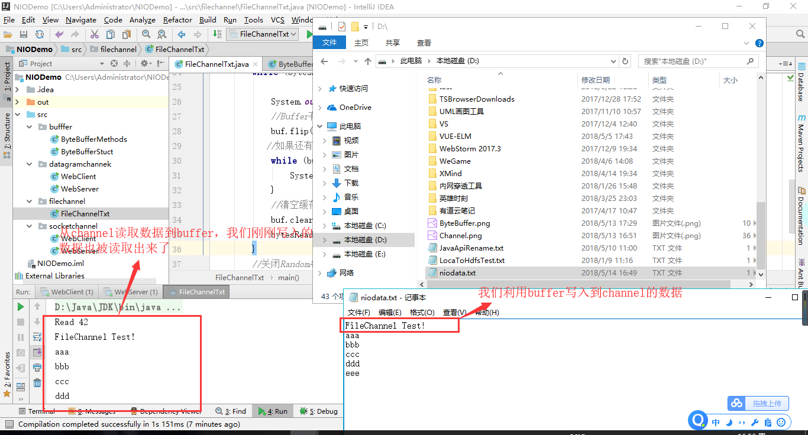
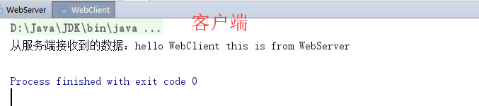
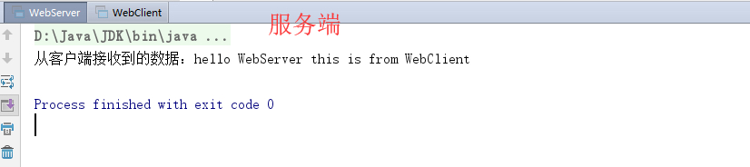
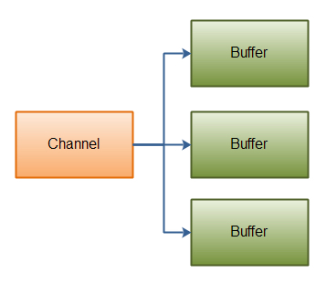
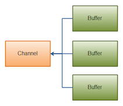

# JavaNIO - Channal

::: tip 此文为转载 （通常一篇文章会参考多处，也会添加自己的理解，引用地址如有遗漏，请指出）

- https://www.cnblogs.com/snailclimb/p/9086335.html

:::

<br />

在Java NIO中，通道是在实体和字节缓冲区之间有效传输数据的媒介。 它从一个实体读取数据，并将其放在缓冲区块中以供消费。通道作为Java NIO提供的网关来访问I/O机制。通常，通道与操作系统文件描述符具有一对一关系，用于提供平台独立操作功能。

- 通道可以读也可以写，流一般来说是单向的（只能读或者写）。
- 通道可以异步读写。
- 通道总是基于缓冲区Buffer来读写。

正如上面提到的，我们可以从通道中读取数据，写入到buffer；也可以中buffer内读数据，写入到通道中。

**Channel的实现类有：**

- FileChannel
- DatagramChannel
- SocketChannel
- ServerSocketChannel

还有一些异步IO类。<br>**FileChannel**用于文件的数据读写。 **DatagramChannel**用于UDP的数据读写。 **SocketChannel**用于TCP的数据读写。 **ServerSocketChannel**允许我们监听TCP链接请求，每个请求会创建会一个SocketChannel。

**类层次结构**

<div style="display:flex;"></div>


<br />

## **FileChannel的使用**

使用FileChannel读取数据到Buffer（缓冲区）以及利用Buffer（缓冲区）写入数据到FileChannel：

```java
package filechannel;

import java.io.IOException;
import java.io.RandomAccessFile;
import java.nio.ByteBuffer;
import java.nio.channels.FileChannel;

public class FileChannelTxt {
    public static void main(String args[]) throws IOException {
        //1.创建一个RandomAccessFile（随机访问文件）对象，
        RandomAccessFile raf=new RandomAccessFile("D:\\niodata.txt", "rw");
        //通过RandomAccessFile对象的getChannel()方法。FileChannel是抽象类。
        FileChannel inChannel=raf.getChannel();
        //2.创建一个读数据缓冲区对象
        ByteBuffer buf=ByteBuffer.allocate(48);
        //3.从通道中读取数据
        int bytesRead = inChannel.read(buf);
        //创建一个写数据缓冲区对象
        ByteBuffer buf2=ByteBuffer.allocate(48);
        //写入数据
        buf2.put("filechannel test".getBytes());
        buf2.flip();
        inChannel.write(buf);
        while (bytesRead != -1) {

            System.out.println("Read " + bytesRead);
            //Buffer有两种模式，写模式和读模式。在写模式下调用flip()之后，Buffer从写模式变成读模式。
            buf.flip();
           //如果还有未读内容
            while (buf.hasRemaining()) {
                System.out.print((char) buf.get());
            }
            //清空缓存区
            buf.clear();
            bytesRead = inChannel.read(buf);
        }
        //关闭RandomAccessFile（随机访问文件）对象
        raf.close();
    }
}
```

运行效果：

<div style="display:flex;"></div>

通过上述实例代码，我们可以大概总结出FileChannel的一般使用规则：

**1. 开启FileChannel**

**使用之前，FileChannel必须被打开** ，但是你无法直接打开FileChannel（FileChannel是抽象类）。需要通过 **InputStream** ， **OutputStream** 或 **RandomAccessFile** 获取FileChannel。<br>我们上面的例子是通过RandomAccessFile打开FileChannel的：

```java
        //1.创建一个RandomAccessFile（随机访问文件）对象，
        RandomAccessFile raf=new RandomAccessFile("D:\\niodata.txt", "rw");
        //通过RandomAccessFile对象的getChannel()方法。FileChannel是抽象类。
        FileChannel inChannel=raf.getChannel();
```

**2. 从FileChannel读取数据/写入数据**

从FileChannel中读取数据/写入数据之前首先要创建一个Buffer（缓冲区）对象，Buffer（缓冲区）对象的使用我们在上一篇文章中已经详细说明了，如果不了解的话可以看我的上一篇关于Buffer的文章。<br>使用FileChannel的read()方法读取数据：

```java
        //2.创建一个读数据缓冲区对象
        ByteBuffer buf=ByteBuffer.allocate(48);
        //3.从通道中读取数据
        int bytesRead = inChannel.read(buf);
```

使用FileChannel的write()方法写入数据：

```java
        //创建一个写数据缓冲区对象
        ByteBuffer buf2=ByteBuffer.allocate(48);
        //写入数据
        buf2.put("filechannel test".getBytes());
        buf2.flip();
        inChannel.write(buf);
```

**3. 关闭FileChannel**

完成使用后，FileChannel您必须关闭它。

```java
		channel.close（）; 
```

## **SocketChannel和ServerSocketChannel的使用**

**利用SocketChannel和ServerSocketChannel实现客户端与服务器端简单通信：**<br>**SocketChannel** 用于创建基于tcp协议的客户端对象，因为SocketChannel中不存在accept()方法，所以，它不能成为一个服务端程序。通过**connect()方法**,SocketChannel对象可以连接到其他tcp服务器程序。<br>客户端:

```java
package socketchannel;

import java.io.IOException;
import java.net.InetSocketAddress;
import java.nio.ByteBuffer;
import java.nio.channels.SocketChannel;

public class WebClient {
    public static void main(String[] args) throws IOException {
        //1.通过SocketChannel的open()方法创建一个SocketChannel对象
        SocketChannel socketChannel = SocketChannel.open();
        //2.连接到远程服务器（连接此通道的socket）
        socketChannel.connect(new InetSocketAddress("127.0.0.1", 3333));
        // 3.创建写数据缓存区对象
        ByteBuffer writeBuffer = ByteBuffer.allocate(128);
        writeBuffer.put("hello WebServer this is from WebClient".getBytes());
        writeBuffer.flip();
        socketChannel.write(writeBuffer);
        //创建读数据缓存区对象
        ByteBuffer readBuffer = ByteBuffer.allocate(128);
        socketChannel.read(readBuffer);
        //String 字符串常量，不可变；StringBuffer 字符串变量（线程安全），可变；StringBuilder 字符串变量（非线程安全），可变
        StringBuilder stringBuffer=new StringBuilder();
        //4.将Buffer从写模式变为可读模式
        readBuffer.flip();
        while (readBuffer.hasRemaining()) {
            stringBuffer.append((char) readBuffer.get());
        }
        System.out.println("从服务端接收到的数据："+stringBuffer);

        socketChannel.close();
    }

}
```

**ServerSocketChannel** 允许我们监听TCP链接请求，通过ServerSocketChannelImpl的 **accept()方法** 可以创建一个SocketChannel对象用户从客户端读/写数据。<br>服务端：

```java
package socketchannel;

import java.io.IOException;
import java.net.InetSocketAddress;
import java.nio.ByteBuffer;
import java.nio.channels.ServerSocketChannel;
import java.nio.channels.SocketChannel;

public class WebServer {
    public static void main(String args[]) throws IOException {
        try {
            //1.通过ServerSocketChannel 的open()方法创建一个ServerSocketChannel对象，open方法的作用：打开套接字通道
            ServerSocketChannel ssc = ServerSocketChannel.open();
            //2.通过ServerSocketChannel绑定ip地址和port(端口号)
            ssc.socket().bind(new InetSocketAddress("127.0.0.1", 3333));
            //通过ServerSocketChannelImpl的accept()方法创建一个SocketChannel对象用户从客户端读/写数据
            SocketChannel socketChannel = ssc.accept();
            //3.创建写数据的缓存区对象
            ByteBuffer writeBuffer = ByteBuffer.allocate(128);
            writeBuffer.put("hello WebClient this is from WebServer".getBytes());
            writeBuffer.flip();
            socketChannel.write(writeBuffer);
            //创建读数据的缓存区对象
            ByteBuffer readBuffer = ByteBuffer.allocate(128);
            //读取缓存区数据
            socketChannel.read(readBuffer);
            StringBuilder stringBuffer=new StringBuilder();
            //4.将Buffer从写模式变为可读模式
            readBuffer.flip();
            while (readBuffer.hasRemaining()) {
                stringBuffer.append((char) readBuffer.get());
            }
            System.out.println("从客户端接收到的数据："+stringBuffer);
            socketChannel.close();
            ssc.close();
        } catch (IOException e) {
            e.printStackTrace();
        }
    }
}
```

运行效果：<br>客户端：

<div style="display:flex;"></div>

服务端：

<div style="display:flex;"></div>

**通过上述实例代码，我们可以大概总结出SocketChannel和ServerSocketChannel的使用的一般使用规则：**<br>下面只给出大致步骤，不贴代码，可以结合上述实例理解。

**客户端**

1. 通过SocketChannel连接到远程服务器
2. 创建读数据/写数据缓冲区对象来读取服务端数据或向服务端发送数据
3. 关闭SocketChannel

**服务端**

1. 通过ServerSocketChannel 绑定ip地址和端口号
2. 通过ServerSocketChannelImpl的accept()方法创建一个SocketChannel对象用户从客户端读/写数据
3. 创建读数据/写数据缓冲区对象来读取客户端数据或向客户端发送数据
4. 关闭SocketChannel和ServerSocketChannel


## **DatagramChannel的使用**

DataGramChannel，类似于java 网络编程的DatagramSocket类；使用UDP进行网络传输， **UDP是无连接，面向数据报文段的协议，对传输的数据不保证安全与完整** ；和上面介绍的SocketChannel和ServerSocketChannel的使用方法类似，所以这里简单介绍一下如何使用。

**1.获取DataGramChannel**

```java
        //1.通过DatagramChannel的open()方法创建一个DatagramChannel对象
        DatagramChannel datagramChannel = DatagramChannel.open();
        //绑定一个port（端口）
        datagramChannel.bind(new InetSocketAddress(1234));
```

上面代码表示程序可以在1234端口接收数据报。

**2.接收/发送消息**

**接收消息：**<br>先创建一个缓存区对象，然后通过receive方法接收消息，这个方法返回一个SocketAddress对象，表示发送消息方的地址：

```java
ByteBuffer buf = ByteBuffer.allocate(48);
buf.clear();
channel.receive(buf);
```

**发送消息：**<br>由于UDP下，服务端和客户端通信并不需要建立连接，只需要知道对方地址即可发出消息，但是是否发送成功或者成功被接收到是没有保证的;发送消息通过send方法发出，改方法返回一个int值，表示成功发送的字节数：

```java
ByteBuffer buf = ByteBuffer.allocate(48);
buf.clear();
buf.put("datagramchannel".getBytes());
buf.flip();
int send = channel.send(buffer, new InetSocketAddress("localhost",1234));
```

这个例子发送一串字符：“datagramchannel”到主机名为”localhost”服务器的端口1234上。


## **Scatter / Gather**

Channel 提供了一种被称为 Scatter/Gather 的新功能，也称为本地矢量 I/O。Scatter/Gather 是指在多个缓冲区上实现一个简单的 I/O 操作。正确使用 Scatter / Gather可以明显提高性能。

大多数现代操作系统都支持本地矢量I/O（native vectored I/O）操作。当您在一个通道上请求一个Scatter/Gather操作时，该请求会被翻译为适当的本地调用来直接填充或抽取缓冲区，减少或避免了缓冲区拷贝和系统调用；

Scatter/Gather应该使用直接的ByteBuffers以从本地I/O获取最大性能优势。

**Scatter/Gather功能是通道(Channel)提供的 并不是Buffer。**<br>- **Scatter:** 从一个Channel读取的信息分散到N个缓冲区中(Buffer).<br>- **Gather:** 将N个Buffer里面内容按照顺序发送到一个Channel.

### **Scattering Reads**

“scattering read”是把数据从单个Channel写入到多个buffer,如下图所示：

<div style="display:flex;"></div>

示例代码：

```java
ByteBuffer header = ByteBuffer.allocate(128);
ByteBuffer body   = ByteBuffer.allocate(1024);

ByteBuffer[] bufferArray = { header, body };

channel.read(bufferArray);
```

read()方法内部会负责把数据按顺序写进传入的buffer数组内。一个buffer写满后，接着写到下一个buffer中。<br>举个例子，假如通道中有200个字节数据，那么header会被写入128个字节数据，body会被写入72个字节数据；

**注意：**<br>无论是scatter还是gather操作，都是按照buffer在数组中的顺序来依次读取或写入的； 


### **Gathering Writes**

“gathering write”把多个buffer的数据写入到同一个channel中，下面是示意图： 

<div style="display:flex;"></div>

示例代码：

```java
ByteBuffer header = ByteBuffer.allocate(128);
ByteBuffer body   = ByteBuffer.allocate(1024);

//write data into buffers

ByteBuffer[] bufferArray = { header, body };

channel.write(bufferArray);
```

write()方法内部会负责把数据按顺序写入到channel中。

**注意：**<br>并不是所有数据都写入到通道，写入的数据要根据position和limit的值来判断，只有position和limit之间的数据才会被写入；<br>举个例子，假如以上header缓冲区中有128个字节数据，但此时position=0，limit=58；那么只有下标索引为0-57的数据才会被写入到通道中。


## **通道之间的数据传输**

在Java NIO中如果一个channel是FileChannel类型的，那么他可以直接把数据传输到另一个channel。 

- **transferFrom()** :transferFrom方法把数据从通道源传输到FileChannel  
- **transferTo()** :transferTo方法把FileChannel数据传输到另一个channel