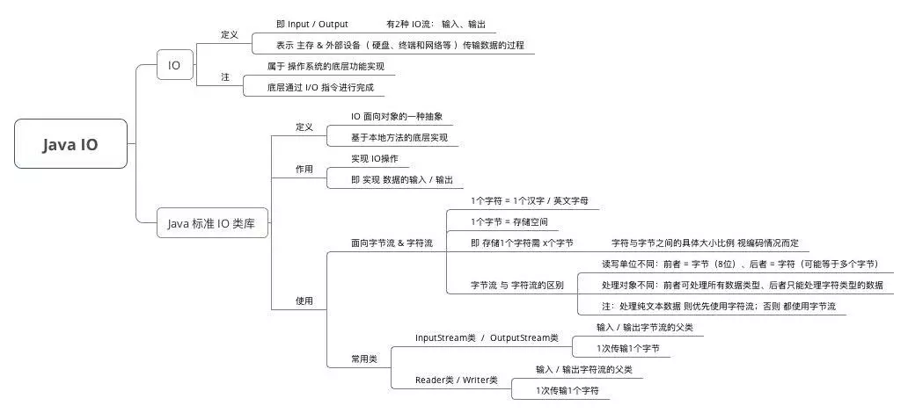
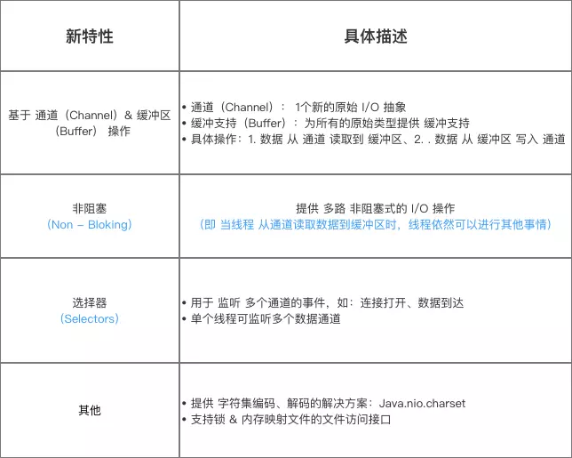
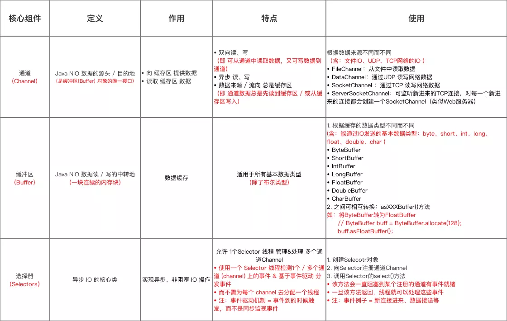
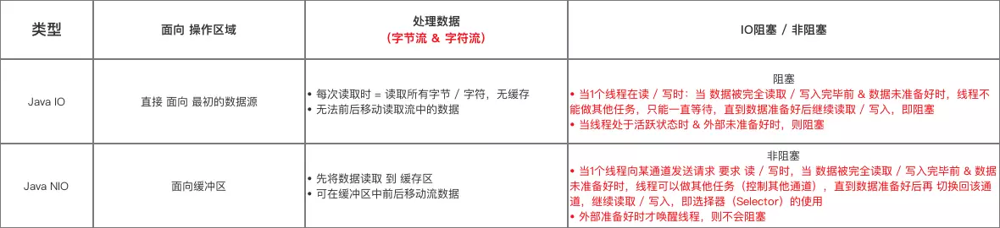
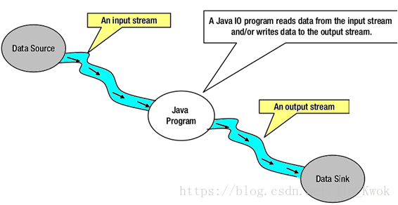
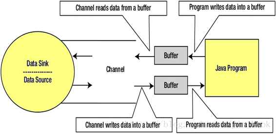
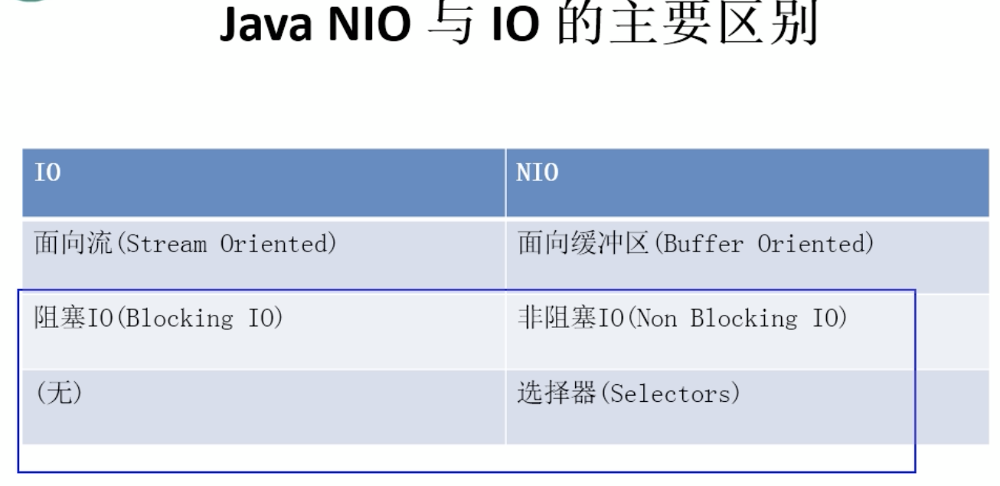

# JavaNIO - 概述

::: tip 此文为转载 （通常一篇文章会参考多处，也会添加自己的理解，引用地址如有遗漏，请指出）

- 引用多出，具体出处想不起来了，如发现，请告知!

:::

 

这里只是综合介绍NIO以及和传统IO的一些比较，至于更多的比较，如两者的关系、在实际使用中该如何选择等，会在后续讲完NIO之后再进一步阐述。

## 储备知识：Java IO

## 对比于 Java IO，NIO具备的新特性如下:

 

## 核心组件

Java NIO的核心组件 包括：

- 通道（Channel）
- 缓冲区（Buffer）
- 选择器（Selectors）

 

## 与Java IO的区别

### 面向流

Java IO是面向流的I/O，这意味着我们需要从流中读取一个或多个字节。它使用流来在数据源/槽和java程序之间传输数据。使用此方法的I/O操作较慢。

下面来看看在Java程序中使用输入/输出流的数据流图(注意：图中输入|输出均以Java Program为参照物)：

 

### 面向缓冲

Java NIO是面向缓存的I/O方法。 将数据读入缓冲器，再使用通道进一步处理数据。 在NIO中，使用通道和缓冲区来处理I/O操作。 通道和流之间的主要区别是： 	- 流可以用于单向数据传输。 	- 通道提供双向数据传输。 因此，通过在java NIO中引入通道，可以执行非阻塞I/O操作。

如下图所示：通道，缓冲区，java程序，数据源和数据接收器之间的相互作用 。

 

### 延伸：NIO 与 IO 区别

**面向流和面向缓冲区**：一个有趣的比喻（引自某个视频）：

- IO 面向流：直接面向数据流动，且是单向的（输入输出相互独立）
- NIO 面向缓冲：可以理解**通道**为铁路（本身没有数据，只负责连接源和目的地）；**缓冲区**类似火车，可以存储数据、卸载数据。显然它是双向的。

**关于其他两个区别，主要是针对网络编程**，查看后续章节

