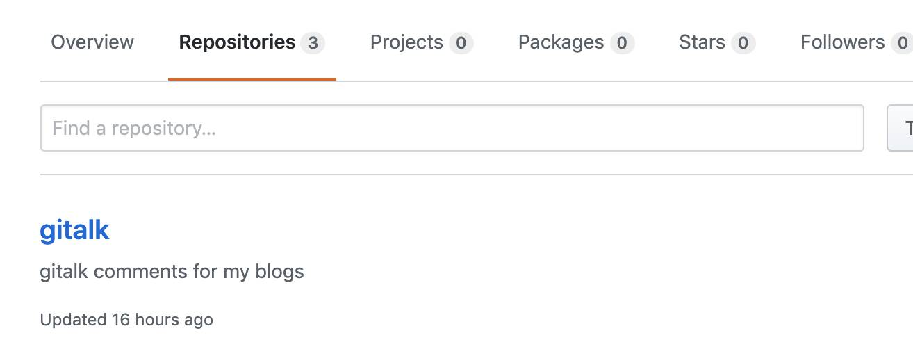
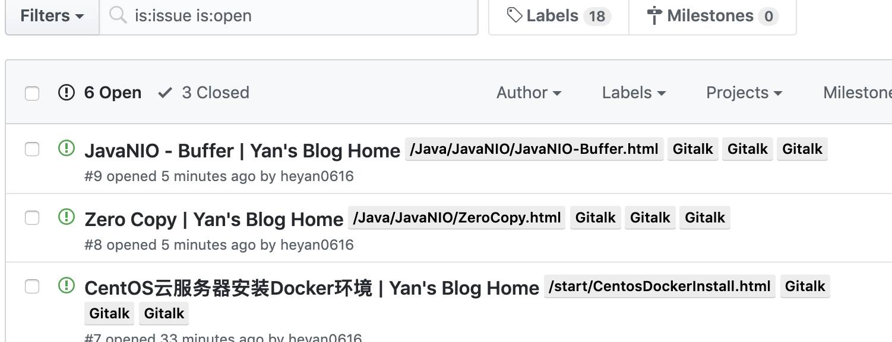

# 给Vuepress博客添加Gitalk评论系统

::: tip 此文为转载 （通常一篇文章会参考多处，也会添加自己的理解，引用地址如有遗漏，请指出）

- https://cloud.tencent.com/developer/article/1533079

:::

想给博客添加一个评论系统，当然一种方法是自己去写一个组件，然后添加进来，后续可以尝试；另外一种就是利用现成的插件。这里我们就使用后者，大概搜了下，主流的方法有这三种valine、gitment、gitalk。第一种要单独注册账号，还需要实名认证什么的，就不想弄了；后面两种方法都是基于现有的github issue系统， 这里我参考了上面的文章使用gitalk来加入评论系统。


## **配置步骤**

#### 1. 新建一个专门的github仓库，这里我命名为gitalk

<div style="display:flex;"></div>


#### 2. 创建一个 OAuth Application

地址：https://github.com/settings/applications/new<br>填写相关信息，这里https://heyan.site:8001/为我的博客首页地址

<div style="display:flex;"></div>


#### 3. 注册后，你会得到”Client ID“和”Client Secret“，供后续使用

#### 4. 创建评论组件

Vuepress 默认 `.vuepress/components` 文件夹下的组件会全局注册, 因此我们创建一个 **comment** 组件，同时下载gitalk.css文件（请点击 [这里](https://cdn.jsdelivr.net/npm/gitalk@1/dist/gitalk.css)）。comment.vue代码如下：

```vue
<template>
  <div class="gitalk-container" style="padding-top: 100px">
    <div id="gitalk-container"></div>
  </div>
</template>
<script>
export default {
  name: 'comment',
  data() {
    return {};
  },
  mounted() {
    let body = document.querySelector('.gitalk-container');
    let script = document.createElement('script');
    script.src = 'https://cdn.jsdelivr.net/npm/gitalk@1/dist/gitalk.min.js';
    body.appendChild(script);
    script.onload = () => {
      const commentConfig = {
        clientID: '16fbf342exxxxxxxxx',
        clientSecret: 'f1f042ae15fcc85e82ff9xxxxxxxxxxxxxxx',
        repo: 'gitalk',
        owner: 'heyan0616',
        // 这里接受一个数组，可以添加多个管理员，可以是你自己
        admin: ['heyan0616'],
        // id 用于当前页面的唯一标识，一般来讲 pathname 足够了，
        // 但是如果你的 pathname 超过 50 个字符，GitHub 将不会成功创建 issue，此情况可以考虑给每个页面生成 hash 值的方法.
        id: location.pathname,
        distractionFreeMode: false,
      };
      const gitalk = new Gitalk(commentConfig);
      gitalk.render('gitalk-container');
    };
  },
};
</script>
<style>
@import '../css/gitalk.css';
</style>
```

此时，我们的目录结构如下：(css文件夹下，存放我们刚下载的gitalk.css文件)

<div style="display:flex;"></div>


#### 5. 添加评论组件

理论上我们直接在markdown文件的末尾处，添加 `<comment/>` 标签就可以使用评论组件了。但这样需要太多手动操作，所以这里使用npm来帮我们自动化：<br>根目录创建 **build** 文件夹, 创建三个文件 addComponents.js, delComponents.js, findMarkdown.js, 分别代码如下：

```js
// addComponents.js
const fs = require("fs");
const findMarkdown = require("./findMarkdown");
const rootDir = "./docs";

findMarkdown(rootDir, writeComponents);

function writeComponents(dir) {
    if (!/README/.test(dir)) {
        fs.appendFile(dir, `\n \n <comment/> \n `, err => {
            if (err) throw err;
            console.log(`add components to ${dir}`);
        });
    }
}
```

```js
// delComponents.js
const fs = require("fs");
const findMarkdown = require("./findMarkdown");
const rootDir = "./docs";

findMarkdown(rootDir, delComponents);

function delComponents(dir) {
    fs.readFile(dir, "utf-8", (err, content) => {
        if (err) throw err;

        fs.writeFile(
            dir,
            content.replace(/\n \n <comment\/> \n /g, ""),
            err => {
                if (err) throw err;
                console.log(`del components from ${dir}`);
            }
        );
    });
}
```

```js
// findMarkdown.js
const fs = require("fs");

function findMarkdown(dir, callback) {
    fs.readdir(dir, function(err, files) {
        if (err) throw err;
        files.forEach(fileName => {
            let innerDir = `${dir}/${fileName}`;
            if (fileName.indexOf(".") !== 0) {
                fs.stat(innerDir, function(err, stat) {
                    if (stat.isDirectory()) {
                        findMarkdown(innerDir, callback);
                    } else {
                        // 跳过readme 文件，当然你也可以自行修改
                        if (/\.md$/.test(fileName) && !/README/.test(fileName))
                            callback(innerDir);
                    }
                });
            }
        });
    });
}
module.exports = findMarkdown;
```

修改 `package.json` 的 `scripts`, 先为每个`md`文件添加组件，然后打包，最后再一一删除 `markdown` 中的 **comment** 组件（这里先添加标签，再打包这些添加后的md文件产生相应的html，最后需要删除 - 否则每次都会新添加一个标签..）

```json
"docs:build": "node ./builds/addComponents.js && vuepress build docs && node ./builds/delComponents.js"
```


#### 6. 至此，你就可以在文章后面看到评论框了

<div style="display:flex;"></div>
管理员账号登录后，就变成

<div style="display:flex;"></div>
在github上，我们也可以看到相应的issue被初始化出来：

<div style="display:flex;"></div>
（这里的意思貌似需要管理员先登录，初始化出后面的issue才能评论。。有待验证）

<br>

<br>

<br>

<br>

<br>

<br>

## Issue

这块内容是后加的，原因是我在使用的过程中发现了一些问题，具体根因还没发现，所以把问题也记录在这，供参考。<br>问题是：按照理想情况，每篇blog的页面初始化后会在github上新建一个issue，然后所有的评论就都在这个issue里面。可实际情况是，每当我刷新页面时，会在github上新建一个issue（即使从表面看起来同一页面创建出来的issue完全一样..），这就导致每次刷新后就无法看到之前的评论了。具体原因还未可知。<br>目前，我把所有博客文章的评论关闭了，只在右上角开了一个单独的留言页面，同时把上面`comment.vue`中的id设置从`id: location.pathname`改成了固定值`id: 'comments'`，这样对于单独的留言页面，这个就可以正常工作了。

综上分析，感觉是这个id的问题，当我们使用`id: location.pathname`时，会自动使用url作唯一id，可能是本网站产生的id有问题导致的。后续有机会再研究，目前博客留言不是必须功能，就先放放了。

<br>

另外，既然我们理解了component组件在vuepress中的应用，按理说我们完全可以自己写一个vue的组件去代替上面的`component.vue`，这就涉及到后台服务和存储，以及如何合理的区分每篇文章，有需要的时候可以尝试！

Good luck！


