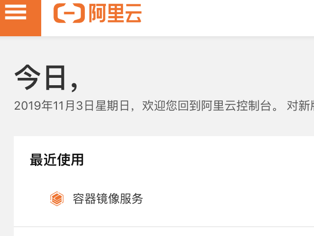

# CentOS云服务器安装Docker环境

因为采用的是阿里云的CentOS服务器，所以本篇是基于CentOS的Docker环境安装与配置。不说了，直接上安装步骤。


## **安装步骤**

#### **1. 确定系统是CentOS7及以上版本**

`cat /etc/redhat-release`

#### 2.**yum安装gcc相关**

```sh
yum -y install gcc
yum -y install gcc-c++
```

:::tip

下面安装步骤可以参考官网：https://docs.docker.com/install/linux/docker-ce/centos/

:::

#### 3.**卸载旧版本**

```sh
sudo yum remove docker \
                  docker-client \
                  docker-client-latest \
                  docker-common \
                  docker-latest \
                  docker-latest-logrotate \
                  docker-logrotate \
                  docker-engine
```

It’s OK if `yum` reports that none of these packages are installed.

#### **4.**安装需要的软件包

Install required packages. `yum-utils` provides the `yum-config-manager` utility, and `device-mapper-persistent-data` and `lvm2` are required by the devicemapper storage driver.

```sh
sudo yum install -y yum-utils \
  device-mapper-persistent-data \
  lvm2
```

Use the following command to set up the **stable** repository.

```sh
#国外镜像源（慢）
yum-config-manager --add-repo https://download.docker.com/linux/centos/docker-ce.repo
#阿里云镜像源（快）
yum-config-manager --add-repo https://mirrors.aliyun.com/docker-ce/linux/centos/docker-ce.repo
```

#### 5.**更新yum软件包索引**

```sh
yum makecache fast
```

#### 6.**安装Docker CE**

```sh
yum -y install docker-ce
```

#### 7.**启动Docker**

```sh
systemctl start docker
```

#### 8.测试

```sh
docker verison 
# Verify that Docker Engine - Community is installed correctly by running the hello-world image
docker run hello-world
```

<br />

<font color="orange" style="font-weight:600;">配置阿里云加速</font>

#### 9.**配置阿里云镜像加速**

https://cr.console.aliyun.com/cn-hangzhou/instances/mirrors

具体可在个人界面“容器镜像服务”里面找到相关服务,如图

<div style="display:flex;"></div>
- **注册阿里云账号**
- **配置镜像加速器**

>针对Docker客户端版本大于 1.10.0 的用户
>
>您可以通过修改daemon配置文件`/etc/docker/daemon.json`来使用加速器
>
>```sh
>sudo mkdir -p /etc/docker
>sudo tee /etc/docker/daemon.json <<-'EOF'
>{
>  "registry-mirrors": ["https://xxxxxx.mirror.aliyuncs.com"]
>}
>EOF
>sudo systemctl daemon-reload
>sudo systemctl restart docker
>```


#### <div style="background:#ffc862">10.**如需卸载，参考如下命令**</div>

``` sh
systemctl stop docker
yum -y remove docker-ce
rm -rf /var/lib/docker
```

