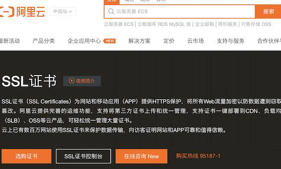
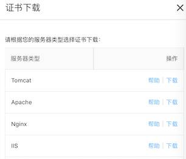
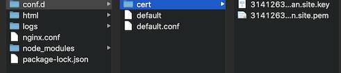

# 网站https升级

之前，网站是http访问的，鉴于目前主流安全的需求，基本所有网站都已经使用https，那也来尝试下吧。本文介绍如何从阿里云申请证书，然后如何升级服务器配置。


## 阿里云申请SSL证书

进入阿里云控制台，搜索“证书服务”，选择SSL证书，进入界面：

<div style="display:flex;"></div>

点“选购证书”

<div style="display:flex;"></div>

选择个人免费版后，然后立即购买。

购买后进入证书控制台界面， >然后根据提示补全个人信息后，>最后提交申请。

几分钟后，证书显示“已签发”

<div style="display:flex;"></div>

最后点击下载，选择Nginx

<div style="display:flex;"></div>

下载解压后，会看到两个文件 （一个.key文件，一个.pem文件）


## 网站升级

目前由于我们单独部署了主页homepage和博客，所以需要都升级一下。


### Homepage升级

1. 在/conf.d文件夹下创建cert文件夹，然后将证书文件copy进去（当然也可以在最外层新建/cert文件夹。。此处图方便，用已有的文件夹存放）

   <div style="display:flex;"></div>

2. 修改default.conf配置文件

   ```yaml
   server {
       listen       443 ssl;
       server_name  heyan.site;
       ssl_certificate  /etc/nginx/conf.d/cert/xxxxxx_heyan.site.pem;
       ssl_certificate_key /etc/nginx/conf.d/cert/xxxxxx_heyan.site.key;
       ssl_session_timeout 5m;
       ssl_ciphers ECDHE-RSA-AES128-GCM-SHA256:ECDHE:ECDH:AES:HIGH:!NULL:!aNULL:!MD5:!ADH:!RC4;
       ssl_protocols TLSv1 TLSv1.1 TLSv1.2;
       ssl_prefer_server_ciphers on;
   
       #charset koi8-r;
       #access_log  /var/log/nginx/host.access.log  main;
   
       location / {
           root    /usr/share/nginx/html;
           index   index.html index.htm;
       }
       error_page   500 502 503 504  /50x.html;
       location = /50x.html {
           root   /usr/share/nginx/html;
       }
   }
   server {
       listen 80;
       server_name heyan.site;
       rewrite ^(.*)$ https://$host$1 permanent;
   }
   ```

   >这里最后的配置是通过rewrite方式把所有http请求也转成了https请求，更加安全，这样所有的http请求就会自动转成https

3. 上传default.conf文件到云服务器

4. 停止并删除原来的容器（需要重建容器来映射新的ssl端口）

   ```sh
   docker stop nginx_homepage
   docker rm nginx_homepage
   ```

5. 基于nginx镜像，新建容器 (注意映射443端口)

   ```sh
   docker run --name nginx_homepage -itd -p 443:443 -p 80:80 
   -v `pwd`/html:/usr/share/nginx/html 
   -v `pwd`/nginx.conf:/etc/nginx/nginx.conf 
   -v `pwd`/conf.d:/etc/nginx/conf.d 
   -v `pwd`/logs:/var/log/nginx 
   nginx
   ```


现在就可以https访问了！


### Blog升级

但此时，跳转到博客的链接还是http的，需要进行同样的改造。

想想之前访问博客时，使用的是http://heyan.site:8001端口，此时，期望不改动其他部分，只是将http换成https。所以，步骤应该是

1，2，3步 应该是和上面homepage升级是一样的

第4步，删除 nginx_blog即可

5. 创建容器时，需要改成如下 - 所以当访问https:heyan.site:8001其实访问的是容器443端口

   ```sh
   docker run --name nginx_blog -itd -p 8001:443 -p 8002:80 
   -v `pwd`/html:/usr/share/nginx/html 
   -v `pwd`/nginx.conf:/etc/nginx/nginx.conf 
   -v `pwd`/conf.d:/etc/nginx/conf.d 
   -v `pwd`/logs:/var/log/nginx 
   nginx
   ```

   （当然，这里没用到8002端口。。）


### **测试**

https://heyan.site/

https://heyan.site:8001/