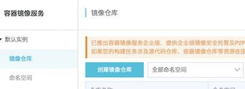
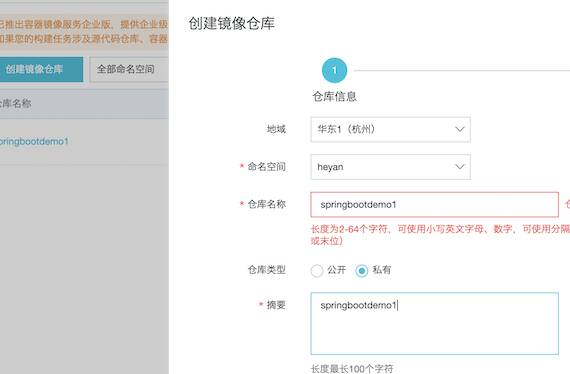
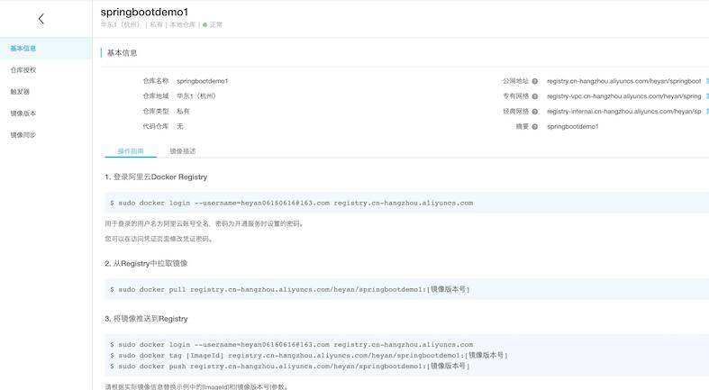
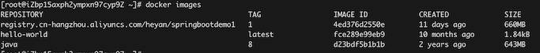

# 发布本地镜像到阿里云服务器

本文主要介绍怎样将本地的Docker镜像发布到远程的阿里云服务器上（各个云厂商都有自己的解决方案，所以其他云服务器的发布不在本文范围）。


## 前提准备

在本地构建好需要发布的镜像springbootdemo1（这里以Springboot Demo项目为例，具体怎么构建Springboot 镜像容器，*请参考*：[Docker Case - Springboot项目部署](https://heyan.site:8001/DevOps/Docker/DockerCase_Springboot.html)）

<div style="display:flex;"></div>


## **登录阿里云开发者平台创建镜像仓库**

- 进入平台界面，进入默认实例->镜像仓库， 如下

<div style="display:flex;"></div>
<br>

- 创建仓库（根据提示先创建<font color="red">命名空间</font>）

<div style="display:flex;"></div>
<br>

- 选择本地仓库

<div style="display:flex;"></div>
<br>

- 创建成功

<div style="display:flex;"></div>


至此，我们就已经在阿里云上创建了属于自己的镜像仓库（类似于docker hub），后面的工作就是将本地镜像push到仓库，然后在云服务器pull下来使用。


## **将镜像推送到阿里云**

- 点击仓库名，进入信息界面 *<font color="red">附带有详细的操作指南</font>*

<div style="display:flex;"></div>
<br>

- 进行相应操作

  - 登录阿里云Docker Registry

    ```sh
    $ sudo docker login --username=xxxxxx registry.cn-hangzhou.aliyuncs.com
    
    #用于登录的用户名为阿里云账号全名，密码为开通服务时设置的密码。
    #您可以在访问凭证页面修改凭证密码。
    ```

  - 将镜像推送到Registry

    >$ sudo docker tag [ImageId] registry.cn-hangzhou.aliyuncs.com/heyan/springbootdemo1:[镜像版本号]
    >
    >$ sudo docker push registry.cn-hangzhou.aliyuncs.com/heyan/springbootdemo1:[镜像版本号]

    ```sh
    docker tag 4ed376d2550e registry.cn-hangzhou.aliyuncs.com/heyan/springbootdemo1:1
    docker push registry.cn-hangzhou.aliyuncs.com/heyan/springbootdemo1:1
    ```

上传成功后，本地也会有一份上传的镜像

<div style="display:flex;"></div>
<br />


## **云服务器拉取镜像**

- 登录阿里云Docker Registry

  ```sh
  $ sudo docker login --username=xxxxxx registry.cn-hangzhou.aliyuncs.com
  ```

- 从Registry中拉取镜像

  > $ sudo docker pull registry.cn-hangzhou.aliyuncs.com/heyan/springbootdemo1:[镜像版本号]

  ```sh
  [root@iZbp15axph2ympxn97cyp9Z ~]# docker pull registry.cn-hangzhou.aliyuncs.com/heyan/springbootdemo1:1
  ```

这时在云服务器上就能看到我们的镜像了

<div style="display:flex;"></div>
<br />

## 总结

总的来说，这个就是在阿里云上建立一个私人的镜像仓库，以此为载体发布本地镜像到云服务器上；事实上我们也可以使用Docker的官方仓库Docker Hub，但鉴于国内的速度... 还是用阿里云的吧。