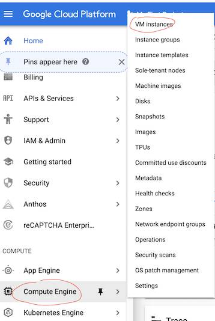
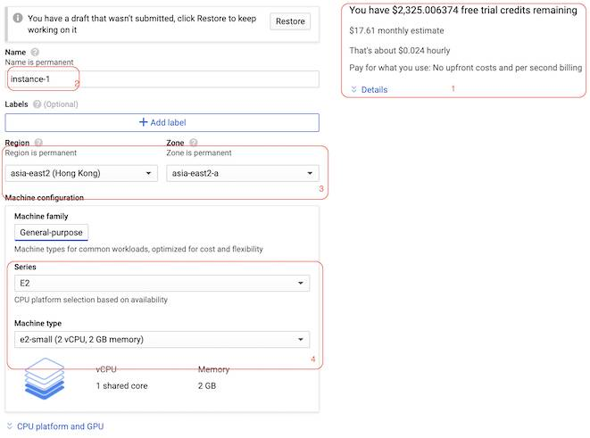
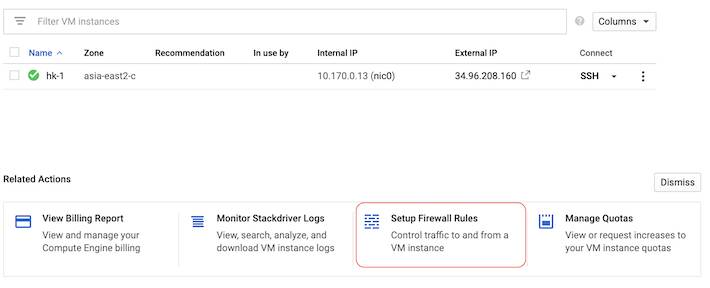
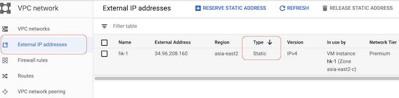
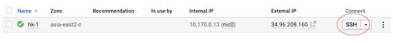
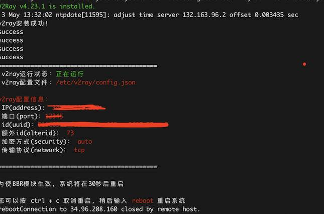
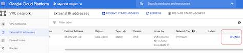
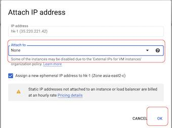
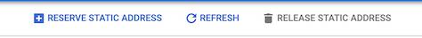

# 基于Google Cloud搭建V2Ray服务器

薅google云的一年试用期的羊毛，顺便搭建V2Ray服务器，解决上网问题


## 申请Google Cloud的VPS

### ▎前提条件

- 你先能上google云，请自行解决... 不在本文讨论范围
- 拥有或创建google账号
- 有一张VISA信用卡（4开头的，开通google cloud需要用到）

### ▎注册 Google Cloud

登录https://cloud.google.com/，点击“**免费开始使用**”，使用自己的google账号登录，地区选择“**香港**”，详细地址随便写个就行，输入你的信用卡，google会先扣除一定额度的money（很快就会退回来）。

当前google提供为期一年的试用期，并提供300$的使用资金（但当我查看账号时显示如下金额，没搞懂~ 不过一年试用期是固定的。估计我也用不完。。）

<div style="display:flex;"></div>
<br>

### ▎创建VPS instance

#### "Compute Engine"->"VM instance"

<br>

<div style="display:flex;"></div>
<br>

#### 然后在instance界面“CREATE INSTANCE”

<br>

<div style="display:flex;"></div>
<br>

#### 创建instance

1. 显示你所选择的instance的价格
2. instance的名字
3. instance的地区（这里选香港，后面Zone可以切换，有时候你所选的zone没有资源了，google会提示你无法创建实例，此时可切换zone再尝试）
4. instance的规格
5. instance的系统选择，这里最好点击“Change”，选择**CentOS**或者RedHat之类我们熟悉的。
6. “Firewall”这里需要都选上

选择完毕后，点击"**Create**"

<div style="display:flex;"></div>
<div style="display:flex;"></div>
<br>

#### 配置防火墙规则 - “Setup Firewall Rules”

<br>

<div style="display:flex;"></div>
点击“**CREATE FIREWALL RULE**” (rule名字自定义，主要关注以下三点)

- 选择应用到所有instances
- source ip设置成所有（也就是0.0.0.0）
- 协议和端口设置为允许所有

<div style="display:flex;"></div>
<br>

#### 设置静态IP

切换到“**External IP addresses**"，点击“**Type**”选择“**Static**”，这样我们就可以有静态的ip地址了

<div style="display:flex;"></div>
<br>

### ▎SSH登录设置

至此，我们的instance就申请成功了。下面我们配置V2Ray服务。

在这之前，我们发现登录google的instance需要点击控制台上的**SSH**打开页面版consol来进行命令操作，非常低效。。

<div style="display:flex;"></div>
我们还是希望类似之前的阿里云，能通过自己的客户端直接ssh上去，所以需要以下设置。

- 点击*ssh*登录到instance，切换到root用户

  ```sh
  //切换到root角色
  sudo -i
  ```

- 修改instance的配置文件

  ```sh
  //修改配置文件
  vi /etc/ssh/sshd_config
  #LoginGraceTime 2m
  PermitRootLogin yes
  
  # To disable tunneled clear text passwords, change to no here!
  PasswordAuthentication yes
  ```

- 修改实例的root密码

  ```sh
  [root@xxx ~]$ passwd
  ```

- *重启实例*

- 从本地登录我们的instance

  ```sh
  hy_mac:bin heyan$ ssh root@34.96.208.160
  root@34.96.208.160's password:
  ```

  

## V2Ray安装配置

参考 [V2Ray一键脚本](https://www.hijk.pw/centos-one-click-install-v2ray/)一文安装配置（V2Ray具体细节可直接登录查看）。

> 原参考文章貌似挂了，可参考 [【小白福利】2021最新*V2Ray*搭建图文教程,*V2Ray一键*搭建*脚本*!](https://www.itblogcn.com/article/406.html)

大概流程记录

- 登录instance执行

  ```sh
  bash <(curl -sL https://raw.githubusercontent.com/hijkpw/scripts/master/centos_install_v2ray.sh)
  ```

  运行成功后会直接显示 V2Ray登录的相关信息

  <div style="display:flex;"></div>

<br>

>#### V2Ray 相关操作
>
>脚本安装完成无误后，可以进行如下操作：
>
>1. 编辑 vim /etc/v2ray/config.json 文件来配置你需要的代理方式；
>2. 运行 **service** v2ray start 来启动 V2Ray 进程；
>3. 之后可以使用 service v2ray start|stop|status|reload|restart|force-reload 控制 V2Ray 的运行。

<br>

## 客户端配置连接

具体使用什么客户端，可自行网上搜索，这里我是mac系统，选用的是**V2RayX**客户端。把刚刚生成的信息填入到客户端，如下

<div style="display:flex;"></div>
<br>

尝试连接youtube试试

<div style="display:flex;"></div>
<br>

好了，You Did it!


<br>

<br>

<br>

<br>

<br>

<br>

<hr>

<br>

## 谷歌云中如何更换IP

某种原因，可能需要更换IP~

具体操作：如之前设置静态ip的时候一样，切换到“**External IP addresses**"，往后拉一点，点击“**CHANGE**”

<div style="display:flex;"></div>

选择"None"

<div style="display:flex;"></div>

此时选择这个server，title上的“**RELEASE STATIC ADDRESS**”就会亮起来，点击它

<div style="display:flex;"></div>

<br>

最后重复之前的操作对新分配的IP，设置为静态IP

<br>

**好消息是，重新设置了IP之后。并不需要其他的操作（如重启服务之类...），之前的相关功能，像SSH登录，已经安装好并正在运行的V2Ray等都能直接使用，当然要改成新IP**


